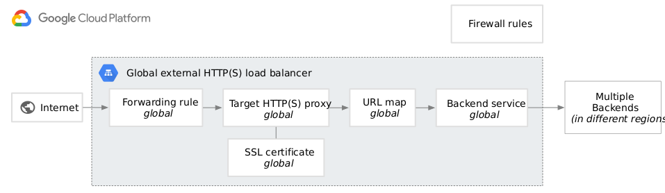

# GKE Deployment with Terraform
This repository contains the Terraform code to deploy a Google Kubernetes Engine (GKE) cluster. 
the cluster set as private cluster with external load balancer.
with the cluster also 2 more applications deployed using helm provider, and NATS.io server

## Providers

- `google` version `4.27.0`
- `google-beta` version `4.27.0`

## Modules

This IaC utilizes the following modules:
- `compute`: This module installs the node group and the helm charts using bash script.
- `google_cloud`: This module installs sql cloud the database and the initial user.
- `network`: This module installs the subnetworks and create peering. 
- `gke`: This module creates a Google Kubernetes Engine (GKE) cluster.
- `helm`: This module installs and configures Helm on the GKE cluster.

## Prerequisites
- Terraform >= 0.14 
- A Google Cloud Platform (GCP) account and project with the necessary permissions to create GKE clusters and other resources.
- Google Cloud SDK
- kubectl
- Helm

## Usage

1. Clone the repository 
'''
    $ git clone git@github.com:LizAsraf/iac_gke_lb.git
'''
2. Navigate to the cloned repository
'''
    $ cd gke-terraform
'''
3. Create a file named `terraform.tfvars` and fill in the necessary variables. An example is provided in the `variables.tf` file.
- Set the values for the following variables in your `terraform.tfvars` file:
  - `instance_type`
  - `region`
  - `project_id`
  - `pods_ipv4_cidr_block`
  - `services_ipv4_cidr_block`
  - `initial_node_count`
  - `database`
  - `username`
  - `password`
  - `db_root_password`
Before running the terraform files, you need to run the following commands:
'''
    $ gcloud config get-value project
    $ gcloud auth application-default login
'''
4. Run `terraform init` to download the required providers
5. Run `terraform plan` to see the resources that will be created
6. Run `terraform apply` to create the resources
7. After the Terraform apply is complete, configure kubectl to connect to the new cluster
'''
    $ gcloud container clusters get-credentials my-cluster-name --region us-central1
'''
8. Verify that you can connect to the cluster
'''
    $ kubectl get nodes
'''

## File Structure

- `main.tf`: the main Terraform configuration file that calls the modules and sets the necessary variables
- `modules/`: a directory containing all the modules used in the configuration
- `variables.tf`:  Terraform variables file
- `terraform.tfvars` : Terraform variables values

## Note

- The code was last tested with Terraform version `0.14`
- This repository is for demonstration purposes and may not be suitable for production use without further modification.

## Additional Resources
- [Google Container Engine](https://cloud.google.com/kubernetes-engine/)
- [Helm](https://helm.sh/)
- [Terraform](https://www.terraform.io/)